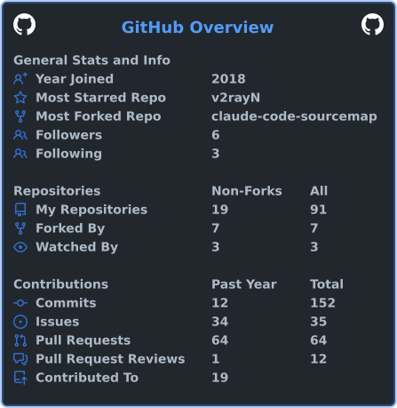
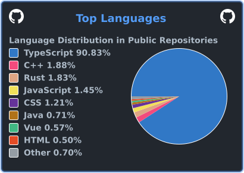

  

  <a href="https://github.com/shenshuoyaoyouguang/CLIProxyAPI">CLIProxyAPI</a> ·
  <a href="https://github.com/shenshuoyaoyouguang/cc-use">cc-use</a> ·
  <a href="https://github.com/shenshuoyaoyouguang/oh-my-claudecode">oh-my-claudecode</a>

---

## 技术栈

  

## GitHub 数据

  
  

  以上统计图由仓库内 GitHub Actions 定时生成，避免依赖公共图床服务。

  <picture>
    <source media="(prefers-color-scheme: dark)" srcset="https://raw.githubusercontent.com/shenshuoyaoyouguang/shenshuoyaoyouguang/output/github-contribution-grid-snake-dark.svg">
    <source media="(prefers-color-scheme: light)" srcset="https://raw.githubusercontent.com/shenshuoyaoyouguang/shenshuoyaoyouguang/output/github-contribution-grid-snake.svg">
    
  </picture>

  

