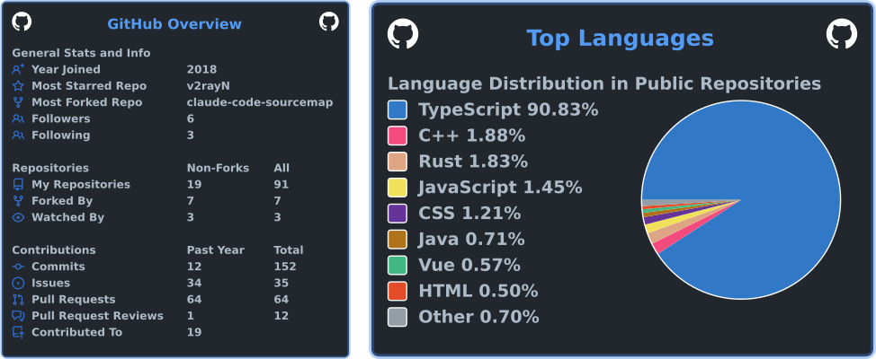

  

  <strong>AI toolchain tinkerer</strong> · CLI / API gateway / reverse engineering 
  日常折腾 AI 工具链，专注 CLI、API 网关与逆向方向的小工具

<!--
  Featured Projects —— 有拿得出手的项目时，取消注释并填写
  (fill in when you have projects worth showing)

## Featured Projects · 精选项目

| Project | Description | Stack |
| --- | --- | --- |
| [project-name](https://github.com/shenshuoyaoyouguang/project-name) | English one-liner · 中文一句话 | Tauri · Rust |
-->

  Daily drivers（常用生态工具）：<a href="https://github.com/shenshuoyaoyouguang/CLIProxyAPI">CLIProxyAPI</a> · <a href="https://github.com/shenshuoyaoyouguang/oh-my-claudecode">oh-my-claudecode</a>

---

## 技术栈

  

## GitHub 数据

  

  以上统计图由仓库内 GitHub Actions 定时生成，避免依赖公共图床服务。

  <picture>
    <source media="(prefers-color-scheme: dark)" srcset="https://raw.githubusercontent.com/shenshuoyaoyouguang/shenshuoyaoyouguang/output/github-contribution-grid-snake-dark.svg">
    <source media="(prefers-color-scheme: light)" srcset="https://raw.githubusercontent.com/shenshuoyaoyouguang/shenshuoyaoyouguang/output/github-contribution-grid-snake.svg">
    
  </picture>

<!--
  Contact / Social —— 填上联系方式后取消注释
  (uncomment and fill in your contact info)

  <a href="mailto:you@example.com">📧 Email</a> ·
  <a href="https://x.com/your-handle">𝕏</a> ·
  <a href="https://your.blog">📝 Blog</a>

-->

  

